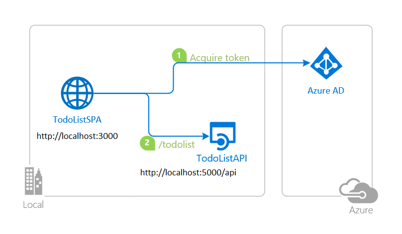
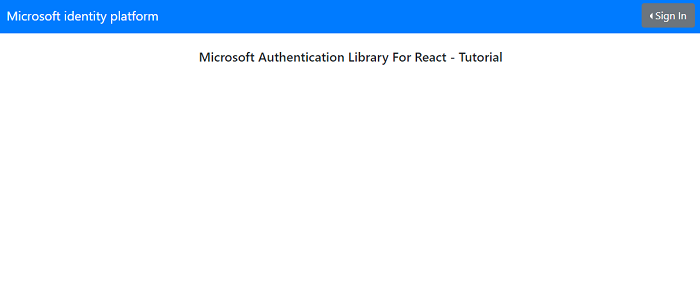
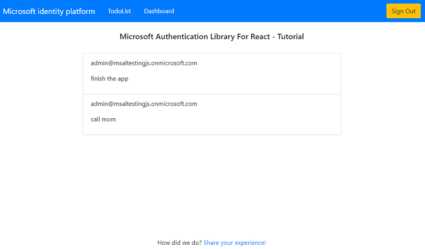

# React single-page application calling Node.js & Express web API using App Roles to implement Role-Based Access Control

 1. [Overview](#overview)
 1. [Scenario](#scenario)
 1. [Contents](#contents)
 1. [Prerequisites](#prerequisites)
 1. [Setup](#setup)
 1. [Registration](#registration)
 1. [Running the sample](#running-the-sample)
 1. [Explore the sample](#explore-the-sample)
 1. [About the code](#about-the-code)
 1. [More information](#more-information)
 1. [Community Help and Support](#community-help-and-support)
 1. [Contributing](#contributing)

## Overview

This sample demonstrates a cross-platform application suite involving an React single-page application (*TodoListSPA*) calling an Node.js & Express web API (*TodoListAPI*) secured with the Microsoft identity platform. In doing so, it implements **Role-based Access Control** (RBAC) by using Azure AD **App Roles**.

Access control in Azure AD can be done with **Security Groups** as well, as we will cover in the [next tutorial](../2-call-api-groups/README.md). **Security Groups** and **App Roles** in Azure AD are by no means mutually exclusive - they can be used in tandem to provide even finer grained access control.

## Scenario

In the sample, a **dashboard** component allows signed-in users to see the tasks assigned to users and is only accessible by users under an **app role** named **TaskAdmin**.

- The **TodoListSPA** uses [MSAL React](https://github.com/AzureAD/microsoft-authentication-library-for-js/tree/dev/lib/msal-react) to authenticate a user with the Microsoft identity platform.
- The app then obtains an [access token](https://docs.microsoft.com/azure/active-directory/develop/access-tokens) from Azure AD on behalf of the authenticated user for the **TodoListAPI**.
- **TodoListAPI** uses [passport-azure-ad](https://github.com/AzureAD/passport-azure-ad) to protect its endpoint and accept only authorized calls.



## Contents

| File/folder                         | Description                                                                   |
|-------------------------------------|-------------------------------------------------------------------------------|
| `SPA/src/authConfig.js`             | Authentication parameters for SPA project reside here.                        |
| `SPA/src/components/RouteGuard.jsx` | This component protects other components that require a user to be in a role. |
| `SPA/src/index.js`                  | MSAL React is initialized here.                                               |
| `API/authConfig.json`               | Authentication parameters for web API project.                                |
| `API/utils/guard.js`                | Custom middleware protecting app routes that require a user to be in a role.  |
| `API/app.js`                        | passport-azure-ad is initialized here.                                        |

## Prerequisites

- An **Azure AD** tenant. For more information see: [How to get an Azure AD tenant](https://docs.microsoft.com/azure/active-directory/develop/quickstart-create-new-tenant)
- At least **two** user accounts in your Azure AD tenant.

## Setup

Using a command line interface such as VS Code integrated terminal, follow the steps below:

### Step 1. Clone the repository

```console
    git clone https://github.com/IvanFarkas/msal-react-call-api-roles.git
```

or download and extract the repository .zip file.

> :warning: To avoid path length limitations on Windows, we recommend cloning into a directory near the root of your drive.

### Step 2. Install Express web API dependencies

```console
    cd API
    npm install
```

### Step 3. Install React SPA dependencies

```console
    cd ../SPA
    npm install
```

## Registration

### Register the sample application(s) with your Azure Active Directory tenant

There are two projects in this sample. Each needs to be separately registered in your Azure AD tenant. To register these projects, you can:

- follow the steps below for manually register your apps
- or use PowerShell scripts that:
  - **automatically** creates the Azure AD applications and related objects (passwords, permissions, dependencies) for you.
  - modify the projects' configuration files.

<details>
  <summary>Expand this section if you want to use this automation:</summary>

> :warning: If you have never used **Azure AD Powershell** before, we recommend you go through the [App Creation Scripts](./AppCreationScripts/AppCreationScripts.md) once to ensure that your environment is prepared correctly for this step.

1. On Windows, run PowerShell as **Administrator** and navigate to the root of the cloned directory
1. If you have never used Azure AD Powershell before, we recommend you go through the [App Creation Scripts](./AppCreationScripts/AppCreationScripts.md) once to ensure that your environment is prepared correctly for this step.
1. In PowerShell run:

   ```PowerShell
   Set-ExecutionPolicy -ExecutionPolicy RemoteSigned -Scope Process -Force
   ```

1. Run the script to create your Azure AD application and configure the code of the sample application accordingly.
1. In PowerShell run:

   ```PowerShell
   cd .\AppCreationScripts\
   .\Configure.ps1
   ```

   > Other ways of running the scripts are described in [App Creation Scripts](./AppCreationScripts/AppCreationScripts.md)
   > The scripts also provide a guide to automated application registration, configuration and removal which can help in your CI/CD scenarios.

</details>

### Choose the Azure AD tenant where you want to create your applications

As a first step you'll need to:

1. Sign in to the [Azure portal](https://portal.azure.com).
1. If your account is present in more than one Azure AD tenant, select your profile at the top right corner in the menu on top of the page, and then **switch directory** to change your portal session to the desired Azure AD tenant.

### Register the service app (msal-node-api-roles)

1. Navigate to the [Azure portal](https://portal.azure.com) and select the **Azure AD** service.
1. Select the **App Registrations** blade on the left, then select **New registration**.
1. In the **Register an application page** that appears, enter your application's registration information:
   - In the **Name** section, enter a meaningful application name that will be displayed to users of the app, for example `msal-node-api-roles`.
   - Under **Supported account types**, select **Accounts in this organizational directory only**.
1. Select **Register** to create the application.
1. In the app's registration screen, find and note the **Application (client) ID**. You use this value in your app's configuration file(s) later in your code.
1. Select **Save** to save your changes.
1. In the app's registration screen, select the **Expose an API** blade to the left to open the page where you can declare the parameters to expose this app as an API for which client applications can obtain [access tokens](https://docs.microsoft.com/azure/active-directory/develop/access-tokens) for.
The first thing that we need to do is to declare the unique [resource](https://docs.microsoft.com/azure/active-directory/develop/v2-oauth2-auth-code-flow) URI that the clients will be using to obtain access tokens for this Api. To declare an resource URI, follow the following steps:
   - Select `Set` next to the **Application ID URI** to generate a URI that is unique for this app.
   - For this sample, accept the proposed Application ID URI (`api://{clientId}`) by selecting **Save**.
1. All APIs have to publish a minimum of one [scope](https://docs.microsoft.com/azure/active-directory/develop/v2-oauth2-auth-code-flow#request-an-authorization-code) for the client's to obtain an access token successfully. To publish a scope, follow the following steps:
   - Select **Add a scope** button open the **Add a scope** screen and Enter the values as indicated below:
        - For **Scope name**, use `access_as_user`.
        - Select **Admins and users** options for **Who can consent?**.
        - For **Admin consent display name** type `Access msal-node-api-roles`.
        - For **Admin consent description** type `Allows the app to access msal-node-api-roles as the signed-in user.`
        - For **User consent display name** type `Access msal-node-api-roles`.
        - For **User consent description** type `Allow the application to access msal-node-api-roles on your behalf.`
        - Keep **State** as **Enabled**.
        - Select the **Add scope** button on the bottom to save this scope.
1. On the right side menu, select the `Manifest` blade.
   - Set `accessTokenAcceptedVersion` property to **2**.
   - Click on **Save**.

#### Define Application Roles

1. Still on the same app registration, select the **App roles** blade to the left.
1. Select **Create app role**:
    - For **Display name**, enter a suitable name, for instance **TaskAdmin**.
    - For **Allowed member types**, choose **User**.
    - For **Value**, enter **TaskAdmin**.
    - For **Description**, enter **Admins can read any user's todo list**.
1. Select **Create app role**:
    - For **Display name**, enter a suitable name, for instance **TaskUser**.
    - For **Allowed member types**, choose **User**.
    - For **Value**, enter **TaskUser**.
    - For **Description**, enter **Users can read and modify their todo lists**.
1. Select **Apply** to save your changes.

To add users to this app role, follow the guidelines here: [Assign users and groups to roles](https://docs.microsoft.com/azure/active-directory/develop/howto-add-app-roles-in-azure-ad-apps#assign-users-and-groups-to-roles).

> :bulb: **Important security tip**
>
> You can configure Azure AD to make sure that only users assigned to your application in the **Users and groups** blade are able to sign-in to your app. To enable this, follow the instructions [here](https://docs.microsoft.com/azure/active-directory/manage-apps/assign-user-or-group-access-portal#configure-an-application-to-require-user-assignment) to set **User assignment required?** to **Yes**. You can assign users directly or by assigning security groups they belong to.

> :information_source: The number of **App Roles** that can be created for an app are limited by the [App Manifest limits](https://docs.microsoft.com/azure/active-directory/develop/reference-app-manifest#manifest-limits).

#### Add local API/.env file

```
# The Application (client) ID of the application you registered.
API_APP_ID="[App Id from above]"

# If your application supports accounts in any organizational directory and personal Microsoft accounts: common
# https://portal.azure.com/#blade/Microsoft_AAD_IAM/ActiveDirectoryMenuBlade/Overview
TENANT_ID="[AAD Tenant Id]"
```

#### Configure the service app (msal-node-api-roles) to use your app registration

Open the project in your IDE (like Visual Studio or Visual Studio Code) to configure the code.

> In the steps below, "ClientID" is the same as "Application ID" or "AppId".

1. Open the `API/.env` file.
1. Set `TENANT_ID` value with your Azure AD tenant ID.
1. Set `API_APP_ID` value with the application ID (clientId) of `msal-react-api-roles` app copied from the Azure portal.

### Register the client app (msal-react-spa-roles)

1. Navigate to the [Azure portal](https://portal.azure.com) and select the **Azure AD** service.
1. Select the **App Registrations** blade on the left, then select **New registration**.
1. In the **Register an application page** that appears, enter your application's registration information:
   - In the **Name** section, enter a meaningful application name that will be displayed to users of the app, for example `msal-react-spa-roles`.
   - Under **Supported account types**, select **Accounts in this organizational directory only**.
   - In the **Redirect URI (optional)** section, select **Single-page application** in the combo-box and enter the following redirect URI: `http://localhost:3000/`.
1. Select **Register** to create the application.
1. In the app's registration screen, find and note the **Application (client) ID**. You use this value in your app's configuration file(s) later in your code.
1. Select **Save** to save your changes.
1. In the app's registration screen, select the **API permissions** blade in the left to open the page where we add access to the APIs that your application needs.
   - Select the **Add a permission** button and then,
   - Ensure that the **My APIs** tab is selected.
   - In the list of APIs, select the API `msal-node-api-roles`.
   - In the **Delegated permissions** section, select the **Access 'msal-node-api-roles'** in the list. Use the search box if necessary.
   - Select the **Add permissions** button at the bottom.

#### Define Application Roles

1. Still on the same app registration, select the **App roles** blade to the left.
1. Select **Create app role**:
    - For **Display name**, enter a suitable name, for instance **TaskAdmin**.
    - For **Allowed member types**, choose **User**.
    - For **Value**, enter **TaskAdmin**.
    - For **Description**, enter **Admins can read any user's todo list**.
1. Select **Create app role**:
    - For **Display name**, enter a suitable name, for instance **TaskUser**.
    - For **Allowed member types**, choose **User**.
    - For **Value**, enter **TaskUser**.
    - For **Description**, enter **Users can read and modify their todo lists**.
1. Select **Apply** to save your changes.

To add users to this app role, follow the guidelines here: [Assign users and groups to roles](https://docs.microsoft.com/azure/active-directory/develop/howto-add-app-roles-in-azure-ad-apps#assign-users-and-groups-to-roles).

#### Add local SPA/.env file

```
# The Application (client) ID of the application you registered.
REACT_APP_APP_ID="[App Id from above]"

# The Azure cloud instance in which your application is registered.
# For the main (or global) Azure cloud: https://login.microsoftonline.com
REACT_APP_CLOUD_INSTANCE_ID="https://login.microsoftonline.com"

# If your application supports accounts in any organizational directory and personal Microsoft accounts: common
# REACT_APP_TENANT_ID="common"
REACT_APP_TENANT_ID="[AAD Tenant Id]"

REACT_APP_REDIRECT_URI="http://localhost:3000"

REACT_APP_WEB_API_SCOPE="api://[APP ID URI of the web API project]/access_as_user"

# The instance of the Microsoft Graph API the application should communicate with.
# For the global Microsoft Graph API endpoint: https://graph.microsoft.com. 
REACT_APP_GRAPH_ME_ENDPOINT="https://graph.microsoft.com/v1.0/me"
```

#### Configure the client app (msal-react-spa-roles) to use your app registration

Open the project in your IDE (like Visual Studio or Visual Studio Code) to configure the code.

> In the steps below, "ClientID" is the same as "Application ID" or "AppId".

1. Open the `SPA\.env` file.
1. Set `REACT_APP_APP_ID` value with the application ID (clientId) of `msal-react-spa-roles` app copied from the Azure portal.
1. Set `REACT_APP_TENANT_ID` value with your Azure AD tenant ID.
1. Set `REACT_APP_WEB_API_SCOPE` value with APP ID URI of the web API project that you've registered earlier, e.g. `api://[APP ID URI of the web API project]/access_as_user`

## Running the sample

Using a command line interface such as **VS Code** integrated terminal, locate the application directory. Then:  

```console
   cd SPA
   npm start
```

In a separate console window, execute the following commands:

```console
   cd ../API
   npm start
```

## Explore the sample

1. Open your browser and navigate to `http://localhost:3000`.
2. Sign-in using the button on top-right:



1. Click on the **TodoList** button to access your (the signed-in user's) todo list:


1. If the signed-in user has the right privileges (i.e. in the right "role"), click on the **Dashboard** button to access every users' todo list:



1. If the signed-in user does not have the right privileges, clicking on the **Dashboard** will give an error:


## About the code

### React RouteGuard component

The client application React SPA has a [RouteGuard](./SPA/src/components/RouteGuard.jsx) component that checks whether a user has the right privileges to access a protected route. It does this by checking `roles` claim in the ID token of the signed-in user:

```javascript
export const RouteGuard = ({ Component, ...props }) => {
  const { instance } = useMsal();
  const [isAuthorized, setIsAuthorized] = useState(false);
  const onLoad = async () => {
    const currentAccount = instance.getActiveAccount();

    if (currentAccount && currentAccount.idTokenClaims['roles']) {
      let intersection = props.roles.filter((role) => currentAccount.idTokenClaims['roles'].includes(role));

      if (intersection.length > 0) {
        setIsAuthorized(true);
      }
    }
  };

  useEffect(() => {
    onLoad();
  }, [instance]);

  return (
    <>
      {isAuthorized ? (
        <Route {...props} render={(routeProps) => <Component {...routeProps} />} />
      ) : (
        <div className="data-area-div">
          <h3>You are unauthorized to view this content.</h3>
        </div>
      )}
    </>
  );
};
```

We then enable **RouteGuard** in [App.jsx](./SPA/src/App.jsx) as follows:

```javascript
const Pages = () => {
  return (
    <Switch>
      <RouteGuard exact path="/todolist" roles={[appRoles.TaskUser, appRoles.TaskAdmin]} Component={TodoList} />
      <RouteGuard exact path="/dashboard" roles={[appRoles.TaskAdmin]} Component={Dashboard} />
    </Switch>
  );
};
```

However, it is important to be aware of that no content on the front-end application can be **truly** secure. That is, our **RouteGuard** component is primarily responsible for rendering the correct pages and other UI elements for a user in a particular role; in the example above, we allow only users in the `TaskAdmin` role to see the `Dashboard` component. In order to **truly** protect data and expose certain REST operations to a selected set of users, we enable **RBAC** on the back-end/web API as well in this sample. This is shown next.

### Express routeGuard middleware

As mentioned before, in order to **truly** implement **RBAC** and secure data, we allow only authorized calls to our web API. We do this by defining an *access matrix* and protecting our routes with a `routeGuard` custom middleware:

```javascript
const routeGuard = (accessMatrix) => {
  return (req, res, next) => {
    if (req.authInfo.roles === undefined) {
      return res.status(403).json({ error: 'No roles claim found!' });
    } else {
      const roles = req.authInfo['roles'];

      if (req.path.includes(accessMatrix.todolist.path)) {
        if (accessMatrix.todolist.methods.includes(req.method)) {
          let intersection = accessMatrix.todolist.roles.filter((role) => roles.includes(role));

          if (intersection.length < 1) {
            return res.status(403).json({ error: 'User does not have the role' });
          }
        } else {
          return res.status(403).json({ error: 'Method not allowed' });
        }
      } else if (req.path.includes(accessMatrix.dashboard.path)) {
        if (accessMatrix.dashboard.methods.includes(req.method)) {
          let intersection = accessMatrix.dashboard.roles.filter((role) => roles.includes(role));

          if (intersection.length < 1) {
            return res.status(403).json({ error: 'User does not have the role' });
          }
        } else {
          return res.status(403).json({ error: 'Method not allowed' });
        }
      } else {
        return res.status(403).json({ error: 'Unrecognized path' });
      }
    }
    next();
  };
};
```

We defined these roles in [authConfig.json](./API/authConfig.json) as follows:

```JSON
"accessMatrix": {
  "todolist": {
    "path": "/todolist",
    "methods": ["GET", "POST", "PUT", "DELETE"],
    "roles": ["TaskUser", "TaskAdmin"]
  },
  "dashboard": {
    "path": "/dashboard",
    "methods": ["GET"],
    "roles": ["TaskAdmin"]
  }
}
```

Finally, in [app.js](./API/app.js), we add the routeGuard middleware to `/api` route:

```javascript
const bearerStrategy = new BearerStrategy(options, (token, done) => {
  // Send user info using the second argument
  done(null, {}, token);
});
const app = express();

app.use(morgan('dev'));
app.use(express.json());
app.use(cors());
app.use(passport.initialize());
passport.use(bearerStrategy);

// Validates token, checks for role and serve
app.use('/api', passport.authenticate('oauth-bearer', { session: false }), routeGuard(config.accessMatrix), router);

const port = process.env.PORT || 5000;

app.listen(port, () => {
  console.log('Listening on port ' + port);
});
```

## More information

- [Microsoft identity platform (Azure Active Directory for developers)](https://docs.microsoft.com/azure/active-directory/develop/)
- [Overview of Microsoft Authentication Library (MSAL)](https://docs.microsoft.com/azure/active-directory/develop/msal-overview)
- [Quickstart: Register an application with the Microsoft identity platform](https://docs.microsoft.com/azure/active-directory/develop/quickstart-register-app)
- [Quickstart: Configure a client application to access web APIs](https://docs.microsoft.com/azure/active-directory/develop/quickstart-configure-app-access-web-apis)
- [Understanding Azure AD application consent experiences](https://docs.microsoft.com/azure/active-directory/develop/application-consent-experience)
- [Understand user and admin consent](https://docs.microsoft.com/azure/active-directory/develop/howto-convert-app-to-be-multi-tenant#understand-user-and-admin-consent)
- [Initialize client applications using MSAL.js](https://docs.microsoft.com/azure/active-directory/develop/msal-js-initializing-client-applications)
- [Single sign-on with MSAL.js](https://docs.microsoft.com/azure/active-directory/develop/msal-js-sso)
- [Handle MSAL.js exceptions and errors](https://docs.microsoft.com/azure/active-directory/develop/msal-handling-exceptions?tabs=javascript)
- [Logging in MSAL.js applications](https://docs.microsoft.com/azure/active-directory/develop/msal-logging?tabs=javascript)
- [Pass custom state in authentication requests using MSAL.js](https://docs.microsoft.com/azure/active-directory/develop/msal-js-pass-custom-state-authentication-request)
- [Prompt behavior in MSAL.js interactive requests](https://docs.microsoft.com/azure/active-directory/develop/msal-js-prompt-behavior)
- [Use MSAL.js to work with Azure AD B2C](https://docs.microsoft.com/azure/active-directory/develop/msal-b2c-overview)

For more information about how OAuth 2.0 protocols work in this scenario and other scenarios, see [Authentication Scenarios for Azure AD](https://docs.microsoft.com/azure/active-directory/develop/authentication-flows-app-scenarios).
